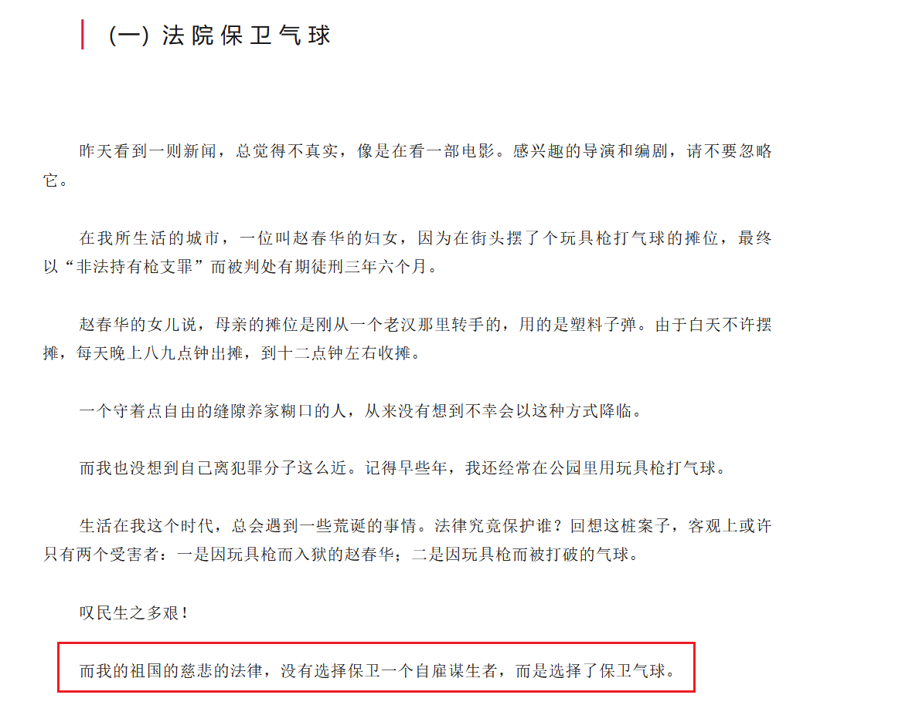

FROM https://web.archive.org/web/20170119050700/http://cache.baiducontent.com/c?m=9d78d513d9d437ad4f9be5697c11c0111b43f7132bddd7027fa58438e2732d41506de4ac53280443939b733d47e90b4beb832b6f724665a09bbf894edfedcf79388850652d439b104f8f5ff8970038c2258d58eaad12fab9fb2f95a4d0d7d85258dd54717e80f38a5d0a1fcb68e71446a2fcdf174b&p=907bc45f8f904ead08e2977b155d&newp=89769a47949c1dff57ee91604f5f92695c02dc3051d0d301298ffe0cc4241a1a1a3aecbb24241502d9c478610abb0f31aba7747d605f76f5c494&user=baidu&fm=sc&query=%D0%DC%C5%E0%EB%85+%BC%D2%95%F8&qid=9a7a04de000272ee&p1=3

---

感慨！！！

---

—.—.—.—.—.—.—.—

|  一 封 家 书 里 的 中 国

赵春华，一位来自外地的母亲，在天津摆了个玩具枪射击气球的小摊，不但被抓了，而且被法院重判了三年半的有期徒刑。 最初读到这则新闻时，我觉得现实无比荒诞，于是就写了篇文章《[叹民生之多艰，法院保卫气球 ](https://web.archive.org/web/20170119050700/http://mp.weixin.qq.com/s?__biz=MzAxMTE5NzE3Mw==&mid=2650684293&idx=3&sn=79738dcaa4aeaeb1b745f71c0883c5b8&chksm=834e541fb439dd091e6a3f65a5a4f939e90ae754ca05ac11111e580ca609a94a6fb3313d5de7&scene=21#wechat_redirect)》。 下午，偶尔读到赵春华写给女儿的信，据说是写在一张面巾纸上托人带出来的： 宝贝你好（：） 妈妈身体很好，不要总是去想着妈妈的事。事情往好想，如果你爸爸和我在一起都完了。这我一个人就好就行了，知足吧。不要担心我怎么样，多大的事情妈妈都能挺过去。 宝贝你要过自己的日子，把精神打起来，和家人好好相处，别影响你们生活。 不要想那么多，我下队还能减行（刑），三年半，有两年就回家了，能减一年，两年一晃就过去。下队之后能和家人会见了，那里吃的还好。你姥爷知道我这个事吗（？）经常给他打个电话问候一下。我的退修（休）让你舅舅在家办吧。我的事情不要找人，钱不少花，办不成钱还不少话。该我有这个节（劫），有这个牢狱之灾。我现在还有3000元，我下队带走了，不要打钱了，够我花几个月了。把你爸爸照看好就行了。 宝贝你要把我耳丁（耳钉）、相连（项链）、左子（镯子）拿你家（字迹不清），耳丁（耳钉）和左子（镯子）在我钱包里。妈妈对不起就是你。宝贝请原谅妈妈。一定要（字迹不清）把身体养好，早点要个孩子。妈妈 初读这封信时我就在想，这哪里是一封普通人的**家书**，它简直是中国底层社会面临厄运时的精神图谱。 看得出，赵春华虽然识一些字，但文化水平不高，所以难免有一些错别字。不过，这不妨碍我看清文字背后的这位中国母亲。她坚强、隐忍、认命，相信与其抗争不如按部就班地活着。 以下是我在这封信里简单读出的一些信息。 其一，涉案后救济渠道的单一或缺失。信里没有与上诉或要求其他法律援助的任何词汇。因为家境贫寒而且没有充分的社会关系，所以在外请人“捞人”的努力也免了。 其二，对厄运的适应。判决下来，就算服几年刑，也认命了。所谓“该我有这个节（劫），有这个牢狱之灾。”既然事情已经发生了，最好的办法是不让它再坏下去，所以调整心态和知足很重要。比如表现好的话可以争取减刑，此外监狱伙食还不错。考虑到前夫因为没有和她在一起而逃过一劫，赵春华甚至庆幸自己此前和他离婚了。 其三，以家族亲情为中心的善良与本分。赵春华在信中嘱咐女儿要照看好女儿的父亲，要经常给姥爷打电话，请舅舅帮办退休，并且劝女儿把身体养好，早生个小孩。这里涉及三代人，都是赵春华生命中最重要的人。为了免得亲人挂念，赵春华还特别强调了自己身体很好。这也从侧面反应了中国人的自我救济主要围绕着亲情展开。 我在赵春华的**家书**中读到了许多底层涉案人员或遭遇不幸者的命运。我不知道中国会有多少类似的案子，但我能猜想绝大多数生活在底层的人会和赵春华一样选择适应环境，忍气吞声。 因为此前的那篇文章，一位据说是在基层法院从事刑事审判也审理过涉枪案件的读者给我留言说，“这里的枪支不是普通的玩具枪支，而是经法定程序鉴定具有杀伤力的枪支，社会危害性极大。”
我并不这样认为。相反，我认为法院以一个似是而非的标准重判一个老实本分的自雇谋生者，为她不幸的命运雪上加霜，才是真正的“社会危害性极大”。 而这也正好解释了为什么此案曝光后会引起社会广泛的关注。
一方面，公众并不认为自己的生命财产安全受到了真正的威胁；另一方面，大家最关心的还是相关判决以及法律的公正性以及具体的人的命运。
这个社会的希望或许在于，虽然常遇世事凉薄，但人心还是热的。