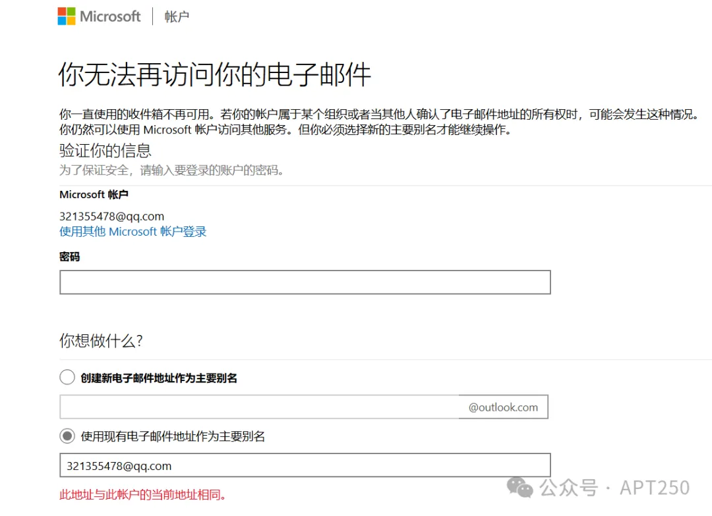

## 未授权强制解绑或绑定任意微软账户邮箱

是的，即将2025年了，或许我们谁都不会想到微软account.live.com上还存在这样如此简单的IDOR，并且它可能已经存在许多年，而这个功能至今仍在被使用

本文提到的所有漏洞均已修复。

## 前言

发现这个微软账户类漏洞并不是因为我刻意去参加微软漏洞赏金计划，而是**源自一场黑客入侵**我的旧微软账户，根据有关情报披露，这场入侵与近期大范围撞库活动有关

我在尝试找回我的旧微软账户时，发现了该漏洞，并成功将我的旧微软账户qq邮箱拯救出来，控制权再度回到我手中，避免了落入黑客之手

时间表

2024.10.30 - 发现漏洞

2024.10.31凌晨 - 提交漏洞至msrc

2024.11.2 - 漏洞状态从"New"更改为"Review/Repro"

2024.11.27 - 漏洞状态从"Review/Repro"更改为"Pre-Release"

2024.11.28 - 微软赏金团队发来邮件，认为该漏洞符合"微软验证赏金计划"，授予60000美元赏金奖励（由于微软在11月中旬恰好推出了“零日任务”计划，赏金提升原来的50%，即40k$+20k$)

2025.1.3 - 倒天闭


## 漏洞1与漏洞2(可能的)概述

msrc将该漏洞评估为：

​      严重性：严重（critical）

​      安全影响：权限提升


该漏洞表明微软账户绑定了任意邮箱或使用任意邮箱注册的账号，将受到此漏洞影响，攻击者可在未经授权情况下，通过该漏洞强制任意邮箱取消验证（解绑），且无法再在原微软账户上重新绑定该邮箱，解绑后攻击者可通过该邮箱重新注册微软账户

而漏洞2(可能的)与漏洞1恰好相反，漏洞1是强制取消验证；而漏洞2(可能的)则是强制验证，也就是强制绑定任意邮箱

**另外，事后我还发现，除了漏洞1和漏洞2(可能的)外，还可能受到漏洞影响的api端点有：邮箱别名绑定或取消**

**我发现的所有可能遭漏洞影响的api端点如下：**

**https://account.live.com/Email/Remove**

**https://account.live.com/Email/Verify**

**https://account.live.com/proofs/Remove**

**https://account.live.com/proofs/AddConfirm**

**https://account.live.com/Aliases/Verify**

**https://account.live.com/Aliases/Remove**

不过由于发现这些东西时微软方面正在修复该问题，所以我并未真正意义成功攻击，具体是否存在将交由微软调查


漏洞1细节

otc（大概率是one time code的缩写）

产生的原因是由于"otc"参数检验存在问题，只要otc=*any(有星号)，那么攻击者将能够操控poc url中的mn参数，导致后端验证失效，从而越权取消验证任意电子邮件地址


这个时候我们再通过已取消验证的电子邮件地址登录login.live.com，我们就会发现我们已经无法再重新绑定该邮箱，但在这个页面必须绑定一个电子邮件地址，否则账号将无法使用，会被强制注销登录



但如果在上图页面中选择绑定其它邮箱后，原来被取消验证的邮箱将无法再通过原邮箱进行登录，直接号（登录方式）没了，这个时候我们就可以重新利用该邮箱重新创建微软账户了，即便不绑定其他邮箱，也仍然可以强行重新注册，具体请看文章的漏洞价值


漏洞2（可能的) - 未授权强制绑定任意邮箱

11月7日，我再度通过otc参数验证问题思考，设想：既然可以强制解绑，那验证呢？

于是我立刻去尝试验证邮箱功能是否存在该问题：

poc url: https://account.live.com/Email/Verify?otc=*anyanyany&mn=test%40qq.com&ru=https://account.microsoft.com/auth/complete-signin&cxt=Default

首先我通过，在微软小号为其识图绑定一个不存在的qq电子邮件地址


此时，微软向该邮箱发送验证邮件，这个时候我们通过poc url，就可以直接验证成功并成功使用新绑定的电子邮件地址登录


然鹅：testminglive1@qq.com压根就不存在，这只是我凭空捏造出来的

这一新的发现也印证了"otc"参数处理的确存在问题，可能有多个功能点受到影响

不过由于发现这些东西时微软方面正在修复该问题，所以我并未真正意义成功攻击，具体是否存在将交由微软调查

## 如何发现该漏洞？

就像前言说的那样，发现该漏洞并非我有意为之，只是我不希望我的旧微软账户qq邮箱落入黑客之手

所以我甚至连burp suite都没有打开，仅在浏览器完成所有操作

2024年10月30日，我的旧qq数字邮箱收到一份来自微软的邮件，内容是我的旧微软账号被异常登录


并且这封邮件在间隔几小时后再次发到我的邮箱上，说明黑客已经通过某种手段破解了我的账户并在一天时间内登录成功了两次

当我尝试通过这个qq数字邮箱在login.live.com上进行登录时，**却发现密码错误，并且所绑定的手机号也不再是我的**

我缺乏对微软账户的理解，且发现无法通过我的qq数字邮箱找回密码，这是非常让我吃惊的，即便是申诉也压根无法通过

```
但问题是，找回密码如果不能通过邮箱找回，那就只能通过手机号短信验证码，问题是手机号已经被黑客篡改
```

**在万般无奈之下，我只能通过qq数字邮箱寻找过去与微软邮箱的历史邮件，试图从过去寻找情报信息**

最终在2018年1月的历史邮件中，我发现了这个：


没错，这是当初绑定qq数字邮箱时的验证码邮件

我把目光投放到了上图箭头所指的`单击此处`的url，当我访问该url时，我惊讶的发现居然还能用！

(由于是漏洞复现以及思路回放，下方相关截图的qq并非上文，而是小号，并且url参数已做脱敏处理)


qq小号


**经过我用最近的邮件和2018年的邮件相关url进行对比**，我发现漏洞产生的原因是由于"otc"参数检验存在问题，只要otc=*any(有星号)，那么攻击者将能够操控poc url中的mn参数，导致后端验证失效，从而越权取消验证任意电子邮件地址


为了确定该漏洞确实存在，我让朋友使用qq邮箱注册一个微软账户，并且利用该漏洞取消验证他的qq邮箱

好友的截图：

此时，被取消验证的邮箱无法再在该微软账户上重新绑定，只能绑定其他的邮箱


经过多次的测试，我发现该漏洞似乎对任意绑定了微软账户的邮箱都有效，更具体的成因让我们交回给微软安全响应中心吧！

## 漏洞价值

最后对于该漏洞的利用价值，我个人认为：该漏洞在攻击者持有受害者邮箱时，利用该漏洞可以将已绑定的邮箱强行解放出来，并允许攻击者利用该邮箱重新注册一个新的微软账户

下图是已绑定的qq邮箱，此时无法再创建账户

(缺乏当时的截图，下图是其它账号演示)


若通过该漏洞强制解绑邮箱之后，将可以重新创建账户！

即便攻击者没有控制相关电子邮件地址控制权，只要攻击者拥有大批量已绑定微软账号的电子邮件列表，那么也能发起大范围恶意攻击，这将会迫使所有受害者必须更换一次电子邮件才能继续使用他们的微软账号。

但更严重的是，威胁行为者可以重复这样的攻击，持续对受害微软账户反复发起这样的攻击，从而影响账户的正常使用。