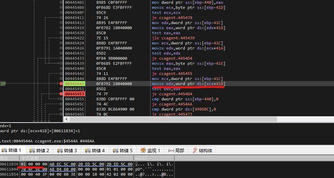

TIA博途是全集成自动化软件TIA portal的简称，是西门子工业自动化集团发布的一款全新的全集成自动化软件。它是业内首个采用统一的工程组态和软件项目环境的自动化软件，几乎适用于所有自动化任务。

##### Part1 漏洞状态

##### Part2 漏洞描述

**分析环境:**

Win10

TIA Portal 15.1 Update 3

##### Part3 漏洞复现

\1. 安装TIA15.1和安装Update 3 更新

\2. 查看是否开启服务进程CCAgent.exe和端口8910

\3. 运行测试脚本，查看进程是否崩溃

\4. 进程崩溃，复现成功！

##### Part4 漏洞分析

\1. 这里判断是否是加密通讯，如果非加密通讯函数流程走不到崩溃的点。需要注意。

\2. 这里校验HdrSize + BodySize 是否等于 MsgSize。如果它不相等，则被视为错误，并且不会处理消息。但是，攻击者可以在数据中自定义数据头大小和正文大小。

\3. 由于把0xFFFF FFFF 用作有符号数，即-1。所以看到原本的ecx(0x74) 加 0xFFFF FFFF后变成 0x73 。所以通过这个校验流程。

\4. 这个流程又把0xFFFF FFFF用作无符号数，导致判断超过预设缓冲区大小0x1000，走到异常流程，导致程序崩溃。

分析完毕。

##### Part5 修复缓解建议

\1. 软件升级到最新版本

\2. 检测读取函数是否溢出