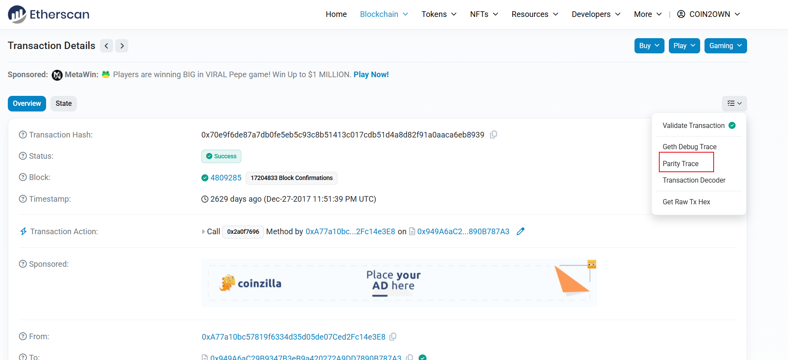

## 题目

题目地址 ： https://archive.aachen.ccc.de/34c3ctf.ccc.ac/challenges/index.html

chaingang

```
send 1505 szabo 457282 babbage 649604 wei 0x949a6ac29b9347b3eb9a420272a9dd7890b787a3
```

首先通过查看题目，我们看到有一些以太坊相关的关键字如 send 、 wei ，还有地址，因此尝试访问 https://etherscan.io/address/0x949a6ac29b9347b3eb9a420272a9dd7890b787a3 果然发现了一个合约。但只有字节码，因此我们需要逆向它。

## 使用在线工具 ethervm.io

ethervm.io 是一个非常不错的在线工具，同时具备反编译(Decompilation)和反汇编(Disassembly)的功能，并且还能够帮你调用 (4byte.directory)[https://www.4byte.directory/] 解析函数的名称。我们截取部分反编译和反汇编后的代码，如下所示：

```
// 反编译
function func_00CC(var arg0) returns (var r0) {
    var var0 = 0x00;

    if (arg0 & 0xffff != storage[0x01] & 0xffff) { return 0x00; }

    memory[0x00:0x20] = msg.sender;
    memory[0x20:0x40] = 0x02;
    return storage[keccak256(memory[0x00:0x40])];
}
// 反汇编
label_0000:
    // Inputs [1] { @0007  msg.data.length }
    0000    60  PUSH1 0x60
    0002    60  PUSH1 0x40
    0004    52  MSTORE
    0005    60  PUSH1 0x04
    0007    36  CALLDATASIZE
    0008    10  LT
    0009    61  PUSH2 0x0057
    000C    57  *JUMPI
    // Stack delta = +0
    // Outputs [1] { @0004  memory[0x40:0x60] = 0x60 }
    // Block ends with conditional jump to 0x0057, if msg.data.length < 0x04
```

一般来讲，查看反编译的代码就可以大致理清代码的实现逻辑了，但如果要深入细节，深入实现原理，看反汇编的代码能够更加清晰。本次我们以解题为目的，先看关键的代码部分。

## 完整的反编译代码

```
contract Contract {
    function main() {
        memory[0x40:0x60] = 0x60;

        if (msg.data.length < 0x04) { revert(memory[0x00:0x00]); }

        var var0 = msg.data[0x00:0x20] / 0x0100000000000000000000000000000000000000000000000000000000 & 0xffffffff;

        if (var0 == 0x2a0f7696) {
            // Dispatch table entry for 0x2a0f7696 (unknown)
            if (msg.value) { revert(memory[0x00:0x00]); }

            var var1 = 0x0081;
            var var2 = msg.data[0x04:0x24] & 0xffff;
            var1 = func_00CC(var2);
            var temp0 = memory[0x40:0x60];
            memory[temp0:temp0 + 0x20] = var1;
            var temp1 = memory[0x40:0x60];
            return memory[temp1:temp1 + (temp0 + 0x20) - temp1];
        } else if (var0 == 0x5b6b431d) {
            // Dispatch table entry for Withdraw(uint256)
            if (msg.value) { revert(memory[0x00:0x00]); }

            var1 = 0x00c0;
            var2 = msg.data[0x04:0x24];
            Withdraw(var2);
            stop();
        } else if (var0 == 0x9f1b3bad) {
            // Dispatch table entry for Receive()
            var1 = 0x00ca;
            Receive();
            stop();
        } else { revert(memory[0x00:0x00]); }
    }

    function func_00CC(var arg0) returns (var r0) {
        var var0 = 0x00;

        if (arg0 & 0xffff != storage[0x01] & 0xffff) { return 0x00; }

        memory[0x00:0x20] = msg.sender;
        memory[0x20:0x40] = 0x02;
        return storage[keccak256(memory[0x00:0x40])];
    }

    function Withdraw(var arg0) {
        if (msg.sender != storage[0x00] & 0xffffffffffffffffffffffffffffffffffffffff) { revert(memory[0x00:0x00]); }

        var temp0 = arg0;
        var temp1 = memory[0x40:0x60];
        var temp2;
        temp2, memory[temp1:temp1 + 0x00] = address(msg.sender).call.gas(!temp0 * 0x08fc).value(temp0)(memory[temp1:temp1 + memory[0x40:0x60] - temp1]);

        if (temp2) { return; }
        else { revert(memory[0x00:0x00]); }
    }

    function Receive() {
        var var0 = 0x00;
        var var1 = var0;
        var var2 = 0x02;
        memory[memory[0x40:0x60] + 0x20:memory[0x40:0x60] + 0x20 + 0x20] = 0x00;
        var temp0 = memory[0x40:0x60];
        memory[temp0:temp0 + 0x20] = msg.value;
        var var3 = temp0 + 0x20;
        var temp1 = memory[0x40:0x60];
        var temp2;
        temp2, memory[temp1:temp1 + 0x20] = address(var2).call.gas(msg.gas - 0x646e)(memory[temp1:temp1 + var3 - temp1]);

        if (!temp2) { revert(memory[0x00:0x00]); }

        var temp3 = memory[memory[0x40:0x60]:memory[0x40:0x60] + 0x20] ~ storage[0x01];
        memory[0x00:0x20] = msg.sender;
        memory[0x20:0x40] = 0x02;
        storage[keccak256(memory[0x00:0x40])] = temp3;
    }
}
```

## 查看主要函数及调用情况


可以看到，总共有 3 个函数接口。第一个 `0x2a0f7696` 没有查到历史函数名称，说明是合约开发者自己写的，这里反编译器把它命名为 `func_00CC` 。而后面两个，是比较常见的函数 `Withdraw` 和 `Receive`。


整理出这5条交易信息如下：

```
1: 0x2a0f7696
2: 0x2a0f7696c1cb
3 :0x2a0f7696000000000000000000000000000000000000000000000000000000000000c1cb
4: 0x9f1b3bad
5: 0x2a0f7696000000000000000000000000000000000000000000000000000000000000c1cb
```

通过查看调用情况，可以看到 `func_00CC` 被调用了四次，`Receive` 被调用了一次。

## 查看函数的功能

因只有 `func_00CC` 和 `Receive` 被调用，这里我们主要查看一下这两个函数的功能。

### func_00CC 函数

这里的 `main()` 函数为入口调试器，用于选择函数。所以调用 `func_00CC` 函数时，先经历下面的代码，一个是函数头，一个是函数执行部分：

1 函数头部分

```
if (var0 == 0x2a0f7696) {
    // Dispatch table entry for 0x2a0f7696 (unknown)
    if (msg.value) { revert(memory[0x00:0x00]); }

    var var1 = 0x0081;
    var var2 = msg.data[0x04:0x24] & 0xffff;
    var1 = func_00CC(var2);
    var temp0 = memory[0x40:0x60];
    memory[temp0:temp0 + 0x20] = var1;
    var temp1 = memory[0x40:0x60];
    return memory[temp1:temp1 + (temp0 + 0x20) - temp1];
```

（1）这里 `if (msg.value) { revert(memory[0x00:0x00]); }` 表示不接受 `msg.value`，即 `solidity` 中的 `not payable`。
（2）由 `var var2 = msg.data[0x04:0x24] & 0xffff;` 可看出，这一个是输入参数部分，从 `0x04` 读取 32 个字节的数据，并 `& 0xffff` ，而没有 `/0x0100000000000000000000000000000000000000000000000000000000` ，说明这是一个占用存储位置为 32 个字节的槽，但参数内容长度为 2 个字节的参数。所以应该是一个 `byte2` 类型的变量。
（3）观察调度器中的几个 if 可以发现其它有些 if 最后是 `return`，有些是 `stop();`。这里的 `return` 说明这个函数是有返回值。

2 接下来看函数执行部分

```
function func_00CC(var arg0) returns (var r0) {
    var var0 = 0x00;

    if (arg0 & 0xffff != storage[0x01] & 0xffff) { return 0x00; }

    memory[0x00:0x20] = msg.sender;
    memory[0x20:0x40] = 0x02;
    return storage[keccak256(memory[0x00:0x40])];
}
```

（1）从 `if (arg0 & 0xffff != storage[0x01] & 0xffff) { return 0x00; }` 可以看出这里是条件判断，判断成功则返回 `0x00`，这里的条件为输入的变量与存储在 `storage[0x01]` 的值进行比较，如果不相等，则返回 `0x00`
（2）通过查看交易信息 `tx -> Tools -> Parity Trace -> Raw traces` 查看发现交易 1、2、3 都是返回 `0x00`。说明都在这个判断 `return 0x00` 了，而交易 5 的返回结果是 `0x333443335f6772616e646d615f626f756768745f736f6d655f626974636f696e` , 说明通过交易4 的 `Receive` 操作，再调用这个 `func_00CC` 函数能够通过这个判断，并执行下面语句

因此，可以尝试解一下这个返回值，应该就是答案。

如何查看？



## 解题

```
>>> from Crypto.Util.number import *
>>> a = 0x333443335f6772616e646d615f626f756768745f736f6d655f626974636f696e
>>> print(long_to_bytes(a))
b'34C3_grandma_bought_some_bitcoin'
>>>
```

## 资料

题目地址 ： https://archive.aachen.ccc.de/34c3ctf.ccc.ac/challenges/index.html

合约地址 : https://etherscan.io/address/0x949a6ac29b9347b3eb9a420272a9dd7890b787a3

反编译地址 ： https://ethervm.io/decompile?address=0x949A6aC29B9347B3eB9a420272A9DD7890B787A3

writeup ： https://github.com/kuqadk3/CTF-and-Learning/blob/master/34c3ctf/crypto/chaingang/readme.md